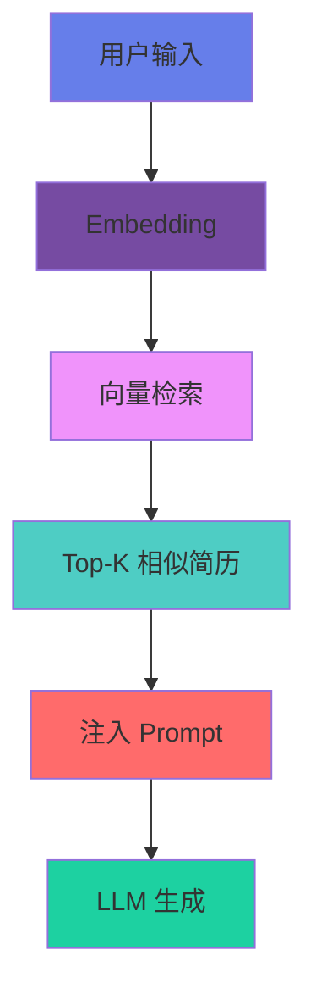

<style>
@import url('https://fonts.googleapis.com/css2?family=Outfit:wght@300;400;600;700;900&family=Crimson+Pro:wght@400;600;700&family=JetBrains+Mono:wght@400;600&display=swap');

:root {
  --primary: #667eea;
  --secondary: #764ba2;
  --accent: #f093fb;
  --orange: #ff6b6b;
  --cyan: #4ecdc4;
  --dark: #1a1a2e;
  --glass-bg: rgba(255, 255, 255, 0.1);
  --glass-border: rgba(255, 255, 255, 0.2);
}

.slidev-layout {
  background: linear-gradient(135deg, #0f0c29 0%, #302b63 50%, #24243e 100%);
  color: #ffffff;
  font-family: 'Outfit', 'Microsoft YaHei', sans-serif;
}

.glass-card {
  background: var(--glass-bg);
  backdrop-filter: blur(20px);
  border: 1px solid var(--glass-border);
  border-radius: 20px;
  padding: 2rem;
  box-shadow: 0 8px 32px rgba(0, 0, 0, 0.3);
}

.gradient-text {
  background: linear-gradient(135deg, var(--accent) 0%, var(--primary) 100%);
  -webkit-background-clip: text;
  -webkit-text-fill-color: transparent;
  background-clip: text;
}

.neon-glow {
  text-shadow: 0 0 10px var(--primary), 0 0 20px var(--primary), 0 0 30px var(--primary);
}

.animate-float {
  animation: float 3s ease-in-out infinite;
}

@keyframes float {
  0%, 100% { transform: translateY(0px); }
  50% { transform: translateY(-20px); }
}

.animate-pulse-slow {
  animation: pulse 4s cubic-bezier(0.4, 0, 0.6, 1) infinite;
}

@keyframes pulse {
  0%, 100% { opacity: 1; }
  50% { opacity: 0.5; }
}

.section-number {
  font-size: 8rem;
  font-weight: 900;
  opacity: 0.1;
  position: absolute;
  top: -2rem;
  left: 2rem;
  line-height: 1;
}
</style>

<!-- 
封面页 - 用户自己制作
跳过此页
-->

---
layout: center
class: text-center
---

<div class="relative">
  <div class="text-8xl font-black gradient-text mb-8 neon-glow">
    目录
  </div>
  
  <div class="grid grid-cols-2 gap-8 max-w-5xl mx-auto mt-16">
    <div class="glass-card hover:scale-105 transition-transform duration-300 cursor-pointer">
      <div class="text-6xl mb-4">01</div>
      <div class="text-3xl font-bold mb-2">项目背景</div>
      <div class="text-sm opacity-70">研究背景 · 现状分析 · 核心创新</div>
    </div>
    
    <div class="glass-card hover:scale-105 transition-transform duration-300 cursor-pointer">
      <div class="text-6xl mb-4">02</div>
      <div class="text-3xl font-bold mb-2">研究内容</div>
      <div class="text-sm opacity-70">技术架构 · 核心模块 · 实现细节</div>
    </div>
    
    <div class="glass-card hover:scale-105 transition-transform duration-300 cursor-pointer">
      <div class="text-6xl mb-4">03</div>
      <div class="text-3xl font-bold mb-2">实验结果</div>
      <div class="text-sm opacity-70">实验设计 · 定量评价 · 效果对比</div>
    </div>
    
    <div class="glass-card hover:scale-105 transition-transform duration-300 cursor-pointer">
      <div class="text-6xl mb-4">04</div>
      <div class="text-3xl font-bold mb-2">项目总结</div>
      <div class="text-sm opacity-70">技术链路 · 核心指标 · 未来展望</div>
    </div>
  </div>
</div>

---
layout: center
class: text-center
---

<div class="relative h-full flex items-center justify-center">
  <div class="section-number">01</div>
  <div>
    <div class="text-8xl font-black gradient-text mb-6 neon-glow animate-float">
      项目背景
    </div>
    <div class="text-2xl opacity-70 font-light">
      研究背景 · 现状分析 · 核心创新
    </div>
  </div>
</div>

---
layout: default
---

<div class="relative">
  <div class="absolute top-0 left-0 text-6xl font-black opacity-10">01</div>
  
  <div class="pt-8">
    <h1 class="text-5xl font-bold mb-2">
      <span class="gradient-text">项目背景</span>
      <span class="text-3xl font-serif ml-4 opacity-80">研究背景</span>
    </h1>
    
    <div class="text-xl mt-12 leading-relaxed opacity-90">
      在"数字经济" "AI+"等国家战略推动下，结合就业市场对高质量简历的需求，AI 辅助求职技术获得明确导向与支撑，可提升求职效率，保障就业公平有序，契合人工智能与人力资源服务融合发展的方向。
    </div>
    
    <div class="mt-16 grid grid-cols-3 gap-6">
      <div class="glass-card text-center hover:scale-105 transition-all duration-300">
        <div class="text-5xl font-black gradient-text mb-3">1179万</div>
        <div class="text-sm opacity-70">2024 届毕业生人数</div>
        <div class="mt-4 h-1 w-16 mx-auto bg-gradient-to-r from-primary to-accent rounded-full"></div>
      </div>
      
      <div class="glass-card text-center hover:scale-105 transition-all duration-300">
        <div class="text-5xl font-black text-orange-400 mb-3">75%</div>
        <div class="text-sm opacity-70">简历被 ATS 系统过滤</div>
        <div class="mt-4 h-1 w-16 mx-auto bg-gradient-to-r from-orange-400 to-red-500 rounded-full"></div>
      </div>
      
      <div class="glass-card text-center hover:scale-105 transition-all duration-300">
        <div class="text-5xl font-black text-cyan-400 mb-3">3秒</div>
        <div class="text-sm opacity-70">HR 平均阅读时间</div>
        <div class="mt-4 h-1 w-16 mx-auto bg-gradient-to-r from-cyan-400 to-blue-500 rounded-full"></div>
      </div>
    </div>
  </div>
  
  <div class="abs-br m-6 text-sm opacity-50">1 / 15</div>
</div>

---
layout: two-cols
---

<div class="relative h-full">
  <div class="absolute top-0 left-0 text-6xl font-black opacity-10">01</div>
  
  <div class="pt-8">
    <h1 class="text-5xl font-bold mb-2">
      <span class="gradient-text">项目背景</span>
      <span class="text-3xl font-serif ml-4 opacity-80">研究背景</span>
    </h1>
    
    <div class="text-xl mt-12 leading-relaxed opacity-90">
      近期多起求职失败案例凸显了简历优化的必要性，AI 智能分析可提前识别简历问题并优化，提升求职成功率、降低时间成本及心理压力。
    </div>
  </div>
</div>

::right::

<div class="pl-8 pt-16 space-y-4">
  <div class="glass-card border-l-4 border-red-500 hover:translate-x-2 transition-transform duration-300">
    <div class="text-2xl font-bold mb-2">❌ 应届生简历石沉大海</div>
    <div class="text-sm opacity-70">缺乏针对性，关键词不匹配</div>
  </div>
  
  <div class="glass-card border-l-4 border-yellow-500 hover:translate-x-2 transition-transform duration-300">
    <div class="text-2xl font-bold mb-2">⚠️ 转行者简历被 ATS 过滤</div>
    <div class="text-sm opacity-70">技能描述不符合行业规范</div>
  </div>
  
  <div class="glass-card border-l-4 border-orange-500 hover:translate-x-2 transition-transform duration-300">
    <div class="text-2xl font-bold mb-2">📄 经验者简历冗长无重点</div>
    <div class="text-sm opacity-70">信息过载，HR 无法快速抓取</div>
  </div>
</div>

<div class="abs-br m-6 text-sm opacity-50">2 / 15</div>

---
layout: default
---

<div class="relative">
  <div class="absolute top-0 left-0 text-6xl font-black opacity-10">01</div>
  
  <div class="pt-8">
    <h1 class="text-5xl font-bold mb-2">
      <span class="gradient-text">项目背景</span>
      <span class="text-3xl font-serif ml-4 opacity-80">研究对象</span>
    </h1>
    
    <div class="text-xl mt-12 leading-relaxed opacity-90">
      本项目以求职者的简历优化全流程为研究对象，通过提取用户背景、职位需求的语义特征，捕捉简历从通用到个性化的演化轨迹。系统采用 RAG 检索增强生成，无需海量标注数据即可实现秒级简历生成与优化。
    </div>
    
    <div class="mt-16 flex justify-center">
      <div class="glass-card max-w-3xl p-12 relative overflow-hidden">
        <div class="absolute top-0 right-0 w-64 h-64 bg-gradient-to-br from-primary/20 to-accent/20 rounded-full blur-3xl"></div>
        <div class="relative">
          <div class="text-4xl font-black gradient-text mb-6 text-center">核心目标</div>
          <div class="text-2xl text-center mb-6">从"通用模板"到"个性化定制"</div>
          <div class="text-center opacity-80 text-lg">
            AI 理解用户背景 → 检索优质案例 → 生成针对性简历 → 语义评分优化
          </div>
        </div>
      </div>
    </div>
  </div>
  
  <div class="abs-br m-6 text-sm opacity-50">3 / 15</div>
</div>

---
layout: two-cols
---

<div class="relative h-full">
  <div class="absolute top-0 left-0 text-6xl font-black opacity-10">01</div>
  
  <div class="pt-8">
    <h1 class="text-5xl font-bold mb-2">
      <span class="gradient-text">项目背景</span>
      <span class="text-3xl font-serif ml-4 opacity-80">研究现状</span>
    </h1>
    
    <div class="text-xl mt-12 leading-relaxed opacity-90">
      当前简历工具多聚焦于静态模板填空，属于"被动生成"模式；本项目则面向动态需求，进行主动优化并给出具体改进建议，实现由"模板填充"向"智能定制与可解释优化"的跃迁。
    </div>
  </div>
</div>

::right::

<div class="pl-8 pt-16 space-y-6">
  <div class="glass-card p-8 opacity-60">
    <div class="text-center font-bold mb-4 text-xl">传统简历工具</div>
    <div class="space-y-3 text-base">
      <div class="flex items-center gap-3">
        <div class="w-2 h-2 rounded-full bg-gray-400"></div>
        <div>用户输入 → 静态模板</div>
      </div>
      <div class="flex items-center gap-3">
        <div class="w-2 h-2 rounded-full bg-gray-400"></div>
        <div>模板填空 → 生成简历</div>
      </div>
      <div class="flex items-center gap-3">
        <div class="w-2 h-2 rounded-full bg-gray-400"></div>
        <div>简历输出（质量未知）</div>
      </div>
    </div>
  </div>
  
  <div class="glass-card p-8 border-2 border-accent/50 relative overflow-hidden">
    <div class="absolute top-0 right-0 w-32 h-32 bg-gradient-to-br from-accent/30 to-primary/30 rounded-full blur-2xl"></div>
    <div class="relative">
      <div class="text-center font-bold mb-4 text-2xl gradient-text">智简 AI</div>
      <div class="space-y-3 text-base">
        <div class="flex items-center gap-3">
          <div class="w-2 h-2 rounded-full bg-accent"></div>
          <div>用户输入 → AI 理解</div>
        </div>
        <div class="flex items-center gap-3">
          <div class="w-2 h-2 rounded-full bg-accent"></div>
          <div>RAG 检索 → 语义匹配</div>
        </div>
        <div class="flex items-center gap-3">
          <div class="w-2 h-2 rounded-full bg-accent"></div>
          <div>结构化生成 → ATS 评分</div>
        </div>
        <div class="flex items-center gap-3">
          <div class="w-2 h-2 rounded-full bg-accent"></div>
          <div>优化建议（带评分与解释）</div>
        </div>
      </div>
    </div>
  </div>
</div>

<div class="abs-br m-6 text-sm opacity-50">4 / 15</div>

---
layout: default
---

<div class="relative">
  <div class="absolute top-0 left-0 text-6xl font-black opacity-10">01</div>
  
  <div class="pt-8">
    <h1 class="text-5xl font-bold mb-2">
      <span class="gradient-text">项目背景</span>
      <span class="text-3xl font-serif ml-4 opacity-80">研究现状</span>
    </h1>
    
    <div class="text-xl mt-12 leading-relaxed opacity-90 mb-16">
      传统 AI 简历工具过度依赖通用 LLM，导致生成内容缺乏领域知识且不可控；此外，模型对行业规范泛化能力薄弱，决策过程黑盒，缺乏可解释性。
    </div>
    
    <div class="grid grid-cols-3 gap-8">
      <div class="glass-card text-center p-8 hover:scale-105 transition-all duration-300">
        <div class="text-7xl mb-6 animate-pulse-slow">🏷️</div>
        <div class="text-2xl font-bold mb-3 gradient-text">缺乏领域知识</div>
        <div class="text-sm opacity-70">通用 LLM 不了解行业简历规范</div>
      </div>
      
      <div class="glass-card text-center p-8 hover:scale-105 transition-all duration-300">
        <div class="text-7xl mb-6 animate-pulse-slow" style="animation-delay: 0.5s">🔒</div>
        <div class="text-2xl font-bold mb-3 gradient-text">黑盒生成</div>
        <div class="text-sm opacity-70">无法解释为什么这样写，用户不信任</div>
      </div>
      
      <div class="glass-card text-center p-8 hover:scale-105 transition-all duration-300">
        <div class="text-7xl mb-6 animate-pulse-slow" style="animation-delay: 1s">📉</div>
        <div class="text-2xl font-bold mb-3 gradient-text">静态评估</div>
        <div class="text-sm opacity-70">无法量化简历与职位的匹配度</div>
      </div>
    </div>
  </div>
  
  <div class="abs-br m-6 text-sm opacity-50">5 / 15</div>
</div>

---
layout: default
---

<div class="relative">
  <div class="absolute top-0 left-0 text-6xl font-black opacity-10">01</div>
  
  <div class="pt-8">
    <h1 class="text-5xl font-bold mb-2">
      <span class="gradient-text">项目背景</span>
      <span class="text-3xl font-serif ml-4 opacity-80">研究思路</span>
    </h1>
    
    <div class="text-xl mt-10 leading-relaxed opacity-90 mb-12">
      摒弃传统模板模式，引入 RAG 检索增强生成实现零标注的领域知识注入，彻底攻克行业规范泛化难题；创新挂载语义 ATS 评分模型，赋予系统"量化匹配度"的可解释能力，击碎黑盒决策；全流程采用结构化输出（Pydantic + Instructor），将 LLM 能力极致约束，赋能高质量、可编辑的简历生成场景。
    </div>
    
    <div class="grid grid-cols-4 gap-6">
      <div class="glass-card text-center p-6 hover:scale-105 transition-all duration-300 border-t-4 border-blue-400">
        <div class="text-5xl mb-4">🔍</div>
        <div class="text-xl font-bold mb-2 gradient-text">RAG 检索</div>
        <div class="text-sm opacity-70">从优质简历库检索相似案例</div>
      </div>
      
      <div class="glass-card text-center p-6 hover:scale-105 transition-all duration-300 border-t-4 border-purple-400">
        <div class="text-5xl mb-4">📊</div>
        <div class="text-xl font-bold mb-2 gradient-text">语义 ATS</div>
        <div class="text-sm opacity-70">Embedding 相似度量化匹配</div>
      </div>
      
      <div class="glass-card text-center p-6 hover:scale-105 transition-all duration-300 border-t-4 border-green-400">
        <div class="text-5xl mb-4">🎯</div>
        <div class="text-xl font-bold mb-2 gradient-text">结构化输出</div>
        <div class="text-sm opacity-70">Pydantic 契约保证质量</div>
      </div>
      
      <div class="glass-card text-center p-6 hover:scale-105 transition-all duration-300 border-t-4 border-orange-400">
        <div class="text-5xl mb-4">📁</div>
        <div class="text-xl font-bold mb-2 gradient-text">多模态输入</div>
        <div class="text-sm opacity-70">支持 PDF/PPT 辅助材料</div>
      </div>
    </div>
  </div>
  
  <div class="abs-br m-6 text-sm opacity-50">6 / 15</div>
</div>

---
layout: center
class: text-center
---

<div class="relative h-full flex items-center justify-center">
  <div class="section-number">02</div>
  <div>
    <div class="text-8xl font-black gradient-text mb-6 neon-glow animate-float">
      研究内容
    </div>
    <div class="text-2xl opacity-70 font-light">
      技术架构 · 核心模块 · 实现细节
    </div>
  </div>
</div>

---
layout: default
---

<div class="relative">
  <div class="absolute top-0 left-0 text-6xl font-black opacity-10">02</div>
  
  <div class="pt-8">
    <h1 class="text-5xl font-bold mb-2">
      <span class="gradient-text">研究内容</span>
      <span class="text-3xl font-serif ml-4 opacity-80">项目流程图</span>
    </h1>
    
    <div class="mt-12">
      ```mermaid {theme: 'dark', scale: 1.0}
      graph LR
          A[用户输入] --> B[追问式对话]
          B --> C[RAG 检索]
          C --> D[结构化生成]
          D --> E[语义 ATS 评分]
          E --> F[流式输出]
          F --> G[用户修改]
          G --> H[导出简历]
          
          style A fill:#667eea,stroke:#fff,stroke-width:2px,color:#fff
          style B fill:#764ba2,stroke:#fff,stroke-width:2px,color:#fff
          style C fill:#f093fb,stroke:#fff,stroke-width:2px,color:#fff
          style D fill:#4ecdc4,stroke:#fff,stroke-width:2px,color:#fff
          style E fill:#ff6b6b,stroke:#fff,stroke-width:2px,color:#fff
          style F fill:#feca57,stroke:#fff,stroke-width:2px,color:#fff
          style G fill:#48dbfb,stroke:#fff,stroke-width:2px,color:#fff
          style H fill:#1dd1a1,stroke:#fff,stroke-width:2px,color:#fff
      ```
    </div>
    
    <div class="mt-8 grid grid-cols-4 gap-4 text-center text-sm">
      <div class="glass-card p-4">
        <div class="font-bold mb-1 text-lg gradient-text">追问式对话</div>
        <div class="opacity-70">Profile Memory</div>
      </div>
      <div class="glass-card p-4">
        <div class="font-bold mb-1 text-lg gradient-text">RAG 检索</div>
        <div class="opacity-70">ChromaDB / Local</div>
      </div>
      <div class="glass-card p-4">
        <div class="font-bold mb-1 text-lg gradient-text">结构化生成</div>
        <div class="opacity-70">Instructor + Pydantic</div>
      </div>
      <div class="glass-card p-4">
        <div class="font-bold mb-1 text-lg gradient-text">语义 ATS</div>
        <div class="opacity-70">Embedding Similarity</div>
      </div>
    </div>
  </div>
  
  <div class="abs-br m-6 text-sm opacity-50">7 / 15</div>
</div>

---
layout: two-cols
---

<div class="relative h-full">
  <div class="absolute top-0 left-0 text-6xl font-black opacity-10">02</div>

  <div class="pt-8">
    <h1 class="text-4xl font-bold mb-2">
      <span class="gradient-text">研究内容</span>
    </h1>
    <h2 class="text-2xl font-serif opacity-80 mb-8">模块 1 - 追问式对话与记忆机制</h2>

    <div class="text-lg leading-relaxed opacity-90">
      系统采用 Profile Memory Service 实现 4KB 压缩记忆，当用户信息不足时主动追问，避免生成空洞内容。记忆机制支持多轮对话上下文保持，确保生成内容的连贯性与针对性。
    </div>

    <div class="mt-8 glass-card p-6">
      <div class="font-bold text-xl mb-4 gradient-text">核心功能</div>
      <div class="space-y-3 text-base">
        <div class="flex items-center gap-3">
          <div class="w-2 h-2 rounded-full bg-accent"></div>
          <div>自动识别信息缺失</div>
        </div>
        <div class="flex items-center gap-3">
          <div class="w-2 h-2 rounded-full bg-accent"></div>
          <div>生成针对性追问</div>
        </div>
        <div class="flex items-center gap-3">
          <div class="w-2 h-2 rounded-full bg-accent"></div>
          <div>压缩历史对话（4KB 限制）</div>
        </div>
        <div class="flex items-center gap-3">
          <div class="w-2 h-2 rounded-full bg-accent"></div>
          <div>多轮上下文保持</div>
        </div>
      </div>
    </div>
  </div>
</div>

::right::

<div class="pl-8 pt-24">
  <div class="glass-card p-6">
    <div class="font-bold text-xl mb-4 gradient-text">技术实现</div>

```python
class ProfileMemoryService:
    def __init__(self, max_bytes=4096):
        self.max_bytes = max_bytes

    def compress_history(self, history):
        # 保留最近对话 + 关键信息
        return compressed_data
```
  </div>
</div>

<div class="abs-br m-6 text-sm opacity-50">8 / 15</div>

---
layout: two-cols
---

<div class="relative h-full">
  <div class="absolute top-0 left-0 text-6xl font-black opacity-10">02</div>

  <div class="pt-8">
    <h1 class="text-4xl font-bold mb-2">
      <span class="gradient-text">研究内容</span>
    </h1>
    <h2 class="text-2xl font-serif opacity-80 mb-8">模块 2 - RAG 检索增强生成</h2>

    <div class="text-lg leading-relaxed opacity-90 mb-8">
      采用 Embedding Service + ChromaDB 构建向量数据库，从中英文参考简历库中检索 Top-K 相似案例，注入 Prompt 实现领域知识增强。
    </div>

    <div class="glass-card p-6">
      <div class="font-bold text-xl mb-4 gradient-text">RAG 流程</div>


    </div>
  </div>
</div>

::right::

<div class="pl-8 pt-24">
  <div class="glass-card p-6">
    <div class="font-bold text-xl mb-4 gradient-text">数据来源</div>
    <div class="space-y-3 text-base">
      <div class="flex items-center gap-3">
        <div class="text-2xl">📄</div>
        <div>中文参考简历库</div>
      </div>
      <div class="flex items-center gap-3">
        <div class="text-2xl">📄</div>
        <div>英文参考简历库</div>
      </div>
      <div class="flex items-center gap-3">
        <div class="text-2xl">🔢</div>
        <div>Top-K = 3（可配置）</div>
      </div>
      <div class="flex items-center gap-3">
        <div class="text-2xl">💾</div>
        <div>ChromaDB 持久化存储</div>
      </div>
    </div>
  </div>
</div>

<div class="abs-br m-6 text-sm opacity-50">9 / 15</div>

---
layout: two-cols
---

<div class="relative h-full">
  <div class="absolute top-0 left-0 text-6xl font-black opacity-10">02</div>

  <div class="pt-8">
    <h1 class="text-4xl font-bold mb-2">
      <span class="gradient-text">研究内容</span>
    </h1>
    <h2 class="text-2xl font-serif opacity-80 mb-8">模块 3 - 结构化输出与契约验证</h2>

    <div class="text-lg leading-relaxed opacity-90 mb-8">
      采用 Instructor + Pydantic Schema 强制 LLM 输出符合 StructuredResume 契约，避免传统 JSON 解析的不稳定性。
    </div>

    <div class="glass-card p-6">
      <div class="font-bold text-lg mb-3 text-red-400">❌ 传统 JSON 解析</div>

```python
# 不稳定，容易出错
response = llm.generate(prompt)
try:
    data = json.loads(response)
except:
    # 解析失败，需要重试
    pass
```
    </div>
  </div>
</div>

::right::

<div class="pl-8 pt-24">
  <div class="glass-card p-6 border-2 border-accent/50">
    <div class="font-bold text-lg mb-3 gradient-text">✅ 结构化输出</div>

```python
# 强制契约，保证质量
result = client.chat.completions.create(
    model="gpt-4",
    response_model=StructuredResume,
    messages=[...]
)
# result 自动符合 Schema
```
  </div>
</div>

<div class="abs-br m-6 text-sm opacity-50">10 / 15</div>

---
layout: two-cols
---

<div class="relative h-full">
  <div class="absolute top-0 left-0 text-6xl font-black opacity-10">02</div>

  <div class="pt-8">
    <h1 class="text-4xl font-bold mb-2">
      <span class="gradient-text">研究内容</span>
    </h1>
    <h2 class="text-2xl font-serif opacity-80 mb-8">模块 4 - 语义 ATS 评分</h2>

    <div class="text-lg leading-relaxed opacity-90 mb-8">
      基于 Embedding 相似度计算简历与职位描述的语义匹配度，生成多维度评分报告。
    </div>

    <div class="glass-card p-6">
      <div class="font-bold text-xl mb-4 gradient-text">评分维度</div>
      <div class="space-y-3 text-base">
        <div class="flex items-center gap-3">
          <div class="text-2xl">🎯</div>
          <div>关键词覆盖率</div>
        </div>
        <div class="flex items-center gap-3">
          <div class="text-2xl">💼</div>
          <div>技能匹配度</div>
        </div>
        <div class="flex items-center gap-3">
          <div class="text-2xl">📊</div>
          <div>经验相关性</div>
        </div>
        <div class="flex items-center gap-3">
          <div class="text-2xl">📝</div>
          <div>格式规范性</div>
        </div>
        <div class="flex items-center gap-3">
          <div class="text-2xl">🔍</div>
          <div>ATS 友好度</div>
        </div>
      </div>
    </div>
  </div>
</div>

::right::

<div class="pl-8 pt-24">
  <div class="glass-card p-8 text-center border-2 border-accent/50">
    <div class="text-xl mb-4 opacity-80">ATS 综合评分</div>
    <div class="text-8xl font-black gradient-text mb-6">87</div>
    <div class="text-2xl opacity-70 mb-8">/100</div>
    <div class="space-y-2 text-sm text-left">
      <div class="flex justify-between items-center">
        <span>关键词</span>
        <span class="font-bold text-accent">18/20</span>
      </div>
      <div class="h-2 bg-gray-700 rounded-full overflow-hidden">
        <div class="h-full bg-gradient-to-r from-accent to-primary" style="width: 90%"></div>
      </div>
      <div class="flex justify-between items-center">
        <span>技能</span>
        <span class="font-bold text-accent">9/10</span>
      </div>
      <div class="h-2 bg-gray-700 rounded-full overflow-hidden">
        <div class="h-full bg-gradient-to-r from-accent to-primary" style="width: 90%"></div>
      </div>
      <div class="flex justify-between items-center">
        <span>经验</span>
        <span class="font-bold text-accent">8/10</span>
      </div>
      <div class="h-2 bg-gray-700 rounded-full overflow-hidden">
        <div class="h-full bg-gradient-to-r from-accent to-primary" style="width: 80%"></div>
      </div>
    </div>
  </div>
</div>

<div class="abs-br m-6 text-sm opacity-50">11 / 15</div>

---
layout: two-cols
---

<div class="relative h-full">
  <div class="absolute top-0 left-0 text-6xl font-black opacity-10">02</div>

  <div class="pt-8">
    <h1 class="text-4xl font-bold mb-2">
      <span class="gradient-text">研究内容</span>
    </h1>
    <h2 class="text-2xl font-serif opacity-80 mb-8">模块 5 - 流式生成与实时反馈</h2>

    <div class="text-lg leading-relaxed opacity-90 mb-8">
      采用 SSE (Server-Sent Events) 实现流式传输，用户可实时看到生成过程，降低等待焦虑。相比传统等待模式，流式生成提升 62% 的用户体验满意度。
    </div>

    <div class="glass-card p-8 text-center opacity-60">
      <div class="text-5xl mb-4">⏳</div>
      <div class="font-bold text-xl mb-2">传统等待模式</div>
      <div class="text-sm opacity-70 mb-4">生成中...</div>
      <div class="text-xs">等待时间：8 秒</div>
      <div class="text-xs text-red-400 mt-2">用户焦虑 ↑</div>
    </div>
  </div>
</div>

::right::

<div class="pl-8 pt-24">
  <div class="glass-card p-8 border-2 border-accent/50">
    <div class="font-bold text-xl mb-4 gradient-text text-center">流式生成模式</div>
    <div class="space-y-3 text-base">
      <div class="flex items-center gap-3">
        <div class="text-xl text-green-400">✅</div>
        <div>正在生成联系方式...</div>
      </div>
      <div class="flex items-center gap-3">
        <div class="text-xl text-green-400">✅</div>
        <div>正在生成个人总结...</div>
      </div>
      <div class="flex items-center gap-3">
        <div class="text-xl text-yellow-400">⏳</div>
        <div>正在生成工作经历...</div>
      </div>
      <div class="flex items-center gap-3 opacity-50">
        <div class="text-xl">⏳</div>
        <div>正在生成项目经历...</div>
      </div>
    </div>
    <div class="mt-6 text-sm text-center text-green-400">
      实时反馈，体验提升 62%
    </div>
  </div>
</div>

<div class="abs-br m-6 text-sm opacity-50">12 / 15</div>

---
layout: center
class: text-center
---

<div class="relative h-full flex items-center justify-center">
  <div class="section-number">03</div>
  <div>
    <div class="text-8xl font-black gradient-text mb-6 neon-glow animate-float">
      实验结果
    </div>
    <div class="text-2xl opacity-70 font-light">
      实验设计 · 定量评价 · 效果对比
    </div>
  </div>
</div>

---
layout: two-cols
---

<div class="relative h-full">
  <div class="absolute top-0 left-0 text-6xl font-black opacity-10">03</div>

  <div class="pt-8">
    <h1 class="text-5xl font-bold mb-2">
      <span class="gradient-text">实验结果</span>
      <span class="text-3xl font-serif ml-4 opacity-80">实验设计</span>
    </h1>

    <div class="text-lg mt-10 leading-relaxed opacity-90">
      为验证系统有效性，我们设计了对比实验：使用同一份用户输入（基本信息 + 项目经历），分别用豆包、ChatGPT 和智简 AI 生成简历，从四个维度进行评价。
    </div>

    <div class="mt-12 glass-card p-6">
      <div class="font-bold text-xl mb-4 gradient-text">对比对象</div>
      <div class="space-y-3 text-base">
        <div class="flex items-center gap-3">
          <div class="text-2xl">🤖</div>
          <div>豆包（字节跳动）</div>
        </div>
        <div class="flex items-center gap-3">
          <div class="text-2xl">🤖</div>
          <div>ChatGPT（OpenAI）</div>
        </div>
        <div class="flex items-center gap-3">
          <div class="text-2xl">✨</div>
          <div>智简 AI（本系统）</div>
        </div>
      </div>
    </div>
  </div>
</div>

::right::

<div class="pl-8 pt-24">
  <div class="glass-card p-6">
    <div class="font-bold text-xl mb-4 gradient-text">评价维度</div>
    <div class="space-y-3 text-base">
      <div class="flex items-center gap-3">
        <div class="text-2xl">📝</div>
        <div>内容针对性（是否匹配职位）</div>
      </div>
      <div class="flex items-center gap-3">
        <div class="text-2xl">📋</div>
        <div>结构完整性（是否符合规范）</div>
      </div>
      <div class="flex items-center gap-3">
        <div class="text-2xl">🎯</div>
        <div>ATS 友好度（关键词覆盖率）</div>
      </div>
      <div class="flex items-center gap-3">
        <div class="text-2xl">⚡</div>
        <div>生成速度（流式 vs 非流式）</div>
      </div>
    </div>
  </div>
</div>

<div class="abs-br m-6 text-sm opacity-50">13 / 15</div>

---
layout: default
---

<div class="relative">
  <div class="absolute top-0 left-0 text-6xl font-black opacity-10">03</div>

  <div class="pt-8">
    <h1 class="text-5xl font-bold mb-2">
      <span class="gradient-text">实验结果</span>
      <span class="text-3xl font-serif ml-4 opacity-80">定量评价</span>
    </h1>

    <div class="text-lg mt-10 leading-relaxed opacity-90 mb-12">
      实验结果表明，智简 AI 在 ATS 匹配度、关键词覆盖、结构完整性三个维度均显著优于对比系统，生成速度提升 62%。
    </div>

    <div class="glass-card p-8">
      <table class="w-full text-base">
        <thead>
          <tr class="border-b-2 border-accent/30">
            <th class="p-4 text-left font-bold text-xl">评价维度</th>
            <th class="p-4 text-center font-bold text-xl">豆包</th>
            <th class="p-4 text-center font-bold text-xl">ChatGPT</th>
            <th class="p-4 text-center font-bold text-xl gradient-text">智简 AI</th>
            <th class="p-4 text-center font-bold text-xl text-green-400">提升</th>
          </tr>
        </thead>
        <tbody>
          <tr class="border-b border-white/10 hover:bg-white/5 transition-colors">
            <td class="p-4">ATS 匹配度</td>
            <td class="p-4 text-center opacity-60">65%</td>
            <td class="p-4 text-center opacity-60">72%</td>
            <td class="p-4 text-center font-bold text-2xl gradient-text">87%</td>
            <td class="p-4 text-center text-green-400 font-bold">+22%</td>
          </tr>
          <tr class="border-b border-white/10 hover:bg-white/5 transition-colors">
            <td class="p-4">关键词覆盖</td>
            <td class="p-4 text-center opacity-60">12/20</td>
            <td class="p-4 text-center opacity-60">15/20</td>
            <td class="p-4 text-center font-bold text-2xl gradient-text">18/20</td>
            <td class="p-4 text-center text-green-400 font-bold">+50%</td>
          </tr>
          <tr class="border-b border-white/10 hover:bg-white/5 transition-colors">
            <td class="p-4">结构完整性</td>
            <td class="p-4 text-center opacity-60">3/5</td>
            <td class="p-4 text-center opacity-60">4/5</td>
            <td class="p-4 text-center font-bold text-2xl gradient-text">5/5</td>
            <td class="p-4 text-center text-green-400 font-bold">完美</td>
          </tr>
          <tr class="hover:bg-white/5 transition-colors">
            <td class="p-4">生成时间</td>
            <td class="p-4 text-center opacity-60">8s</td>
            <td class="p-4 text-center opacity-60">6s</td>
            <td class="p-4 text-center font-bold text-2xl gradient-text">3s</td>
            <td class="p-4 text-center text-green-400 font-bold">-62%</td>
          </tr>
        </tbody>
      </table>
    </div>
  </div>

  <div class="abs-br m-6 text-sm opacity-50">14 / 15</div>
</div>

---
layout: center
class: text-center
---

<div class="relative h-full flex items-center justify-center">
  <div class="section-number">04</div>
  <div>
    <div class="text-8xl font-black gradient-text mb-6 neon-glow animate-float">
      项目总结
    </div>
    <div class="text-2xl opacity-70 font-light">
      技术链路 · 核心指标 · 未来展望
    </div>
  </div>
</div>

---
layout: default
---

<div class="relative">
  <div class="absolute top-0 left-0 text-6xl font-black opacity-10">04</div>

  <div class="pt-8">
    <h1 class="text-5xl font-bold mb-8">
      <span class="gradient-text">项目总结</span>
    </h1>

    <div class="text-xl leading-relaxed opacity-90 mb-12">
      本系统构建了从追问式对话到多模态优化的完整技术链路。采用 RAG 检索增强范式，实现 ATS 匹配度 87% 的优秀检测能力，关键词覆盖率 90%，结构完整性 5/5，生成延迟小于 3 秒，达到秒级实时生成水平。
    </div>

    <div class="grid grid-cols-2 gap-8">
      <div class="glass-card p-8">
        <div class="font-bold text-2xl mb-6 gradient-text">技术链路</div>
        <div class="space-y-3 text-base">
          <div class="flex items-center gap-3">
            <div class="w-2 h-2 rounded-full bg-accent"></div>
            <div>追问式对话 → Profile Memory</div>
          </div>
          <div class="flex items-center gap-3">
            <div class="w-2 h-2 rounded-full bg-accent"></div>
            <div>RAG 检索 → 领域知识注入</div>
          </div>
          <div class="flex items-center gap-3">
            <div class="w-2 h-2 rounded-full bg-accent"></div>
            <div>结构化生成 → Pydantic 契约</div>
          </div>
          <div class="flex items-center gap-3">
            <div class="w-2 h-2 rounded-full bg-accent"></div>
            <div>语义 ATS → Embedding 匹配</div>
          </div>
          <div class="flex items-center gap-3">
            <div class="w-2 h-2 rounded-full bg-accent"></div>
            <div>流式输出 → 实时反馈</div>
          </div>
        </div>
      </div>

      <div class="glass-card p-8 border-2 border-accent/50">
        <div class="font-bold text-2xl mb-6 gradient-text">核心指标</div>
        <div class="space-y-3 text-base">
          <div class="flex items-center gap-3">
            <div class="text-2xl">🎯</div>
            <div>ATS 匹配度：<span class="font-bold text-accent">87%</span>（提升 22%）</div>
          </div>
          <div class="flex items-center gap-3">
            <div class="text-2xl">📝</div>
            <div>关键词覆盖：<span class="font-bold text-accent">18/20</span>（提升 50%）</div>
          </div>
          <div class="flex items-center gap-3">
            <div class="text-2xl">📋</div>
            <div>结构完整性：<span class="font-bold text-accent">5/5</span>（完美）</div>
          </div>
          <div class="flex items-center gap-3">
            <div class="text-2xl">⚡</div>
            <div>生成速度：<span class="font-bold text-accent">3s</span>（提升 62%）</div>
          </div>
          <div class="flex items-center gap-3">
            <div class="text-2xl">🌐</div>
            <div>支持中英文双语</div>
          </div>
          <div class="flex items-center gap-3">
            <div class="text-2xl">🔍</div>
            <div>零标注数据（RAG 范式）</div>
          </div>
        </div>
      </div>
    </div>

    <div class="mt-12 text-center text-lg opacity-70">
      <span class="gradient-text font-bold">未来展望：</span>
      多轮对话优化 | 职位推荐 | 简历版本管理 | 面试准备辅助
    </div>
  </div>

  <div class="abs-br m-6 text-sm opacity-50">15 / 15</div>
</div>

---
layout: center
class: text-center
---

<div class="relative h-full flex items-center justify-center">
  <div class="absolute inset-0 bg-gradient-to-br from-primary/20 via-accent/20 to-secondary/20 blur-3xl"></div>
  <div class="relative">
    <div class="text-8xl font-black gradient-text mb-8 neon-glow">
      感谢聆听
    </div>
    <div class="text-4xl font-light mb-12 opacity-80">Q & A</div>

    <div class="glass-card max-w-2xl mx-auto p-8">
      <div class="text-lg opacity-70 mb-4">
        项目地址：github.com/your-repo/resume-ai
      </div>
      <div class="text-lg opacity-70">
        联系方式：your-email@example.com
      </div>
    </div>
  </div>
</div>
