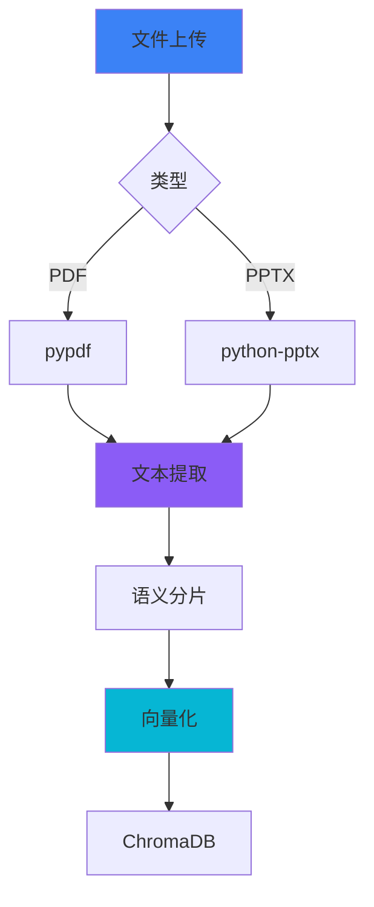
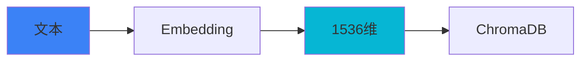
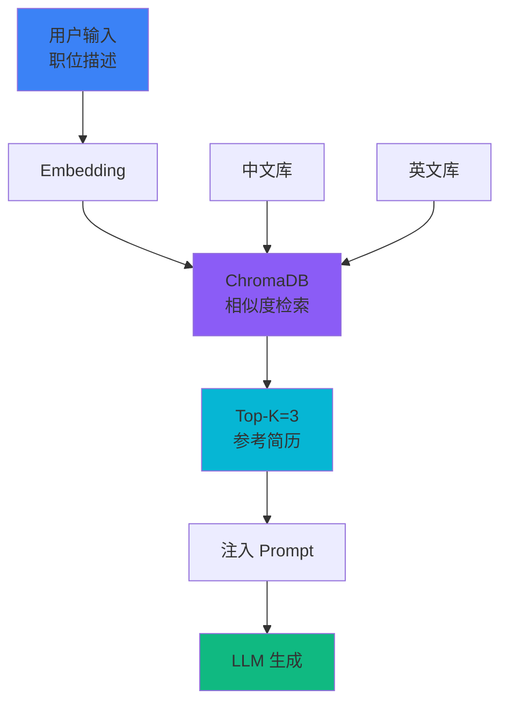
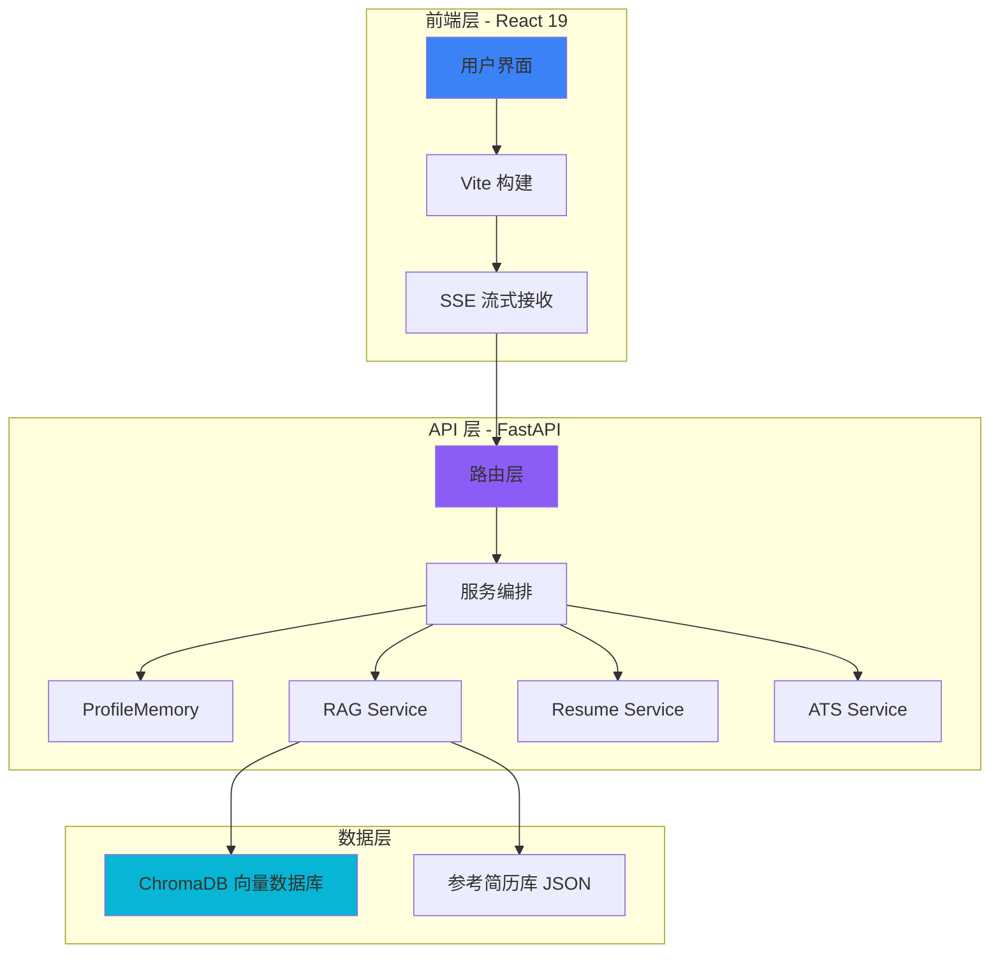

<style>
.slidev-layout {
  background: linear-gradient(135deg, #0f0c29 0%, #302b63 50%, #24243e 100%);
  color: #f1f5f9;
}

.gradient-text {
  background: linear-gradient(135deg, #3b82f6 0%, #8b5cf6 50%, #06b6d4 100%);
  -webkit-background-clip: text;
  -webkit-text-fill-color: transparent;
  background-clip: text;
  font-weight: 700;
}

.tech-grid {
  display: grid;
  grid-template-columns: repeat(6, 1fr);
  gap: 1.5rem;
  margin-top: 3rem;
}

.tech-item {
  text-align: center;
  padding: 1rem;
  background: rgba(255, 255, 255, 0.05);
  border-radius: 12px;
  transition: all 0.3s;
}

.tech-item:hover {
  background: rgba(255, 255, 255, 0.1);
  transform: scale(1.05);
}
</style>

# <span class="gradient-text">智简 AI</span>

## 基于 RAG 与语义分析的个性化简历优化平台

全国大学生计算机程序设计大赛 · 软件应用与开发（Web 应用与开发）

<div class="tech-grid">
  <div class="tech-item">⚡<br/>FastAPI</div>
  <div class="tech-item">⚛️<br/>React 19</div>
  <div class="tech-item">🗄️<br/>ChromaDB</div>
  <div class="tech-item">🔍<br/>RAG</div>
  <div class="tech-item">📊<br/>Pydantic</div>
  <div class="tech-item">🌊<br/>SSE</div>
</div>

---
layout: center
class: text-center
---

# 目录

<div class="grid grid-cols-2 gap-8 mt-12">

<div class="p-8 bg-blue-500/10 rounded-xl">
<div class="text-5xl font-black text-blue-400 mb-3">01</div>
<div class="text-2xl font-bold mb-2">项目背景</div>
<div class="text-sm opacity-70">行业现状 · 核心创新</div>
</div>

<div class="p-8 bg-purple-500/10 rounded-xl">
<div class="text-5xl font-black text-purple-400 mb-3">02</div>
<div class="text-2xl font-bold mb-2">核心技术架构</div>
<div class="text-sm opacity-70">Web 架构 · RAG 检索</div>
</div>

<div class="p-8 bg-cyan-500/10 rounded-xl">
<div class="text-5xl font-black text-cyan-400 mb-3">03</div>
<div class="text-2xl font-bold mb-2">算法实现与评估</div>
<div class="text-sm opacity-70">实验设计 · 性能对比</div>
</div>

<div class="p-8 bg-green-500/10 rounded-xl">
<div class="text-5xl font-black text-green-400 mb-3">04</div>
<div class="text-2xl font-bold mb-2">项目总结</div>
<div class="text-sm opacity-70">技术链路 · 未来展望</div>
</div>

</div>

---
layout: center
---

# <span class="gradient-text">一. 项目背景</span>

行业现状 · 核心创新 · 研究目标

---
layout: two-cols
---

# 背景挑战

## 传统 AI 简历生成的"黑盒"困局

通用 LLM 缺乏行业领域知识，且生成的 JSON 格式极不稳定。本项目通过 RAG 范式引入专家知识库，解决 Web 端内容生成的不可控难题。

### ❌ 传统工具痛点

- 缺乏领域知识，内容空洞
- JSON 格式不稳定，解析失败
- 黑盒生成，缺乏可解释性

::right::

<div class="pl-8 pt-12">

<div class="p-6 bg-red-500/10 rounded-xl mb-6 border-l-4 border-red-500">
<div class="text-5xl font-black text-red-400">75%</div>
<div class="text-sm opacity-70 mt-2">简历被 ATS 系统过滤</div>
</div>

<div class="p-6 bg-orange-500/10 rounded-xl mb-6 border-l-4 border-orange-500">
<div class="text-5xl font-black text-orange-400">3秒</div>
<div class="text-sm opacity-70 mt-2">HR 平均阅读时间</div>
</div>

<div class="p-6 bg-yellow-500/10 rounded-xl border-l-4 border-yellow-500">
<div class="text-5xl font-black text-yellow-400">1179万</div>
<div class="text-sm opacity-70 mt-2">2024 届毕业生人数</div>
</div>

</div>

---
layout: default
---

# 核心创新

## 构建高可解释性的结构化简历生成闭环

我们不仅在做 Web 应用，更在定义一套基于 Pydantic 契约的简历生成标准，确保生成质量的 100% 完整性与可编辑性。

<div class="grid grid-cols-4 gap-6 mt-12">

<div class="p-6 bg-blue-500/10 rounded-xl border-t-4 border-blue-400 text-center">
<div class="text-5xl mb-4">🔍</div>
<div class="text-xl font-bold mb-2 gradient-text">RAG 检索</div>
<div class="text-sm opacity-70">零标注领域知识注入</div>
</div>

<div class="p-6 bg-purple-500/10 rounded-xl border-t-4 border-purple-400 text-center">
<div class="text-5xl mb-4">📊</div>
<div class="text-xl font-bold mb-2 gradient-text">语义 ATS</div>
<div class="text-sm opacity-70">1536 维向量空间匹配</div>
</div>

<div class="p-6 bg-cyan-500/10 rounded-xl border-t-4 border-cyan-400 text-center">
<div class="text-5xl mb-4">🎯</div>
<div class="text-xl font-bold mb-2 gradient-text">结构化输出</div>
<div class="text-sm opacity-70">Pydantic 契约保证</div>
</div>

<div class="p-6 bg-green-500/10 rounded-xl border-t-4 border-green-400 text-center">
<div class="text-5xl mb-4">🌊</div>
<div class="text-xl font-bold mb-2 gradient-text">流式传输</div>
<div class="text-sm opacity-70">SSE 实时反馈</div>
</div>

</div>

<div class="mt-12 text-center p-8 bg-gradient-to-r from-blue-500/10 to-purple-500/10 rounded-xl">
<div class="text-2xl font-bold mb-4 gradient-text">核心目标</div>
<div class="text-xl mb-4">从"通用模板"到"个性化定制"</div>
<div class="text-base opacity-80">
AI 理解用户背景 → 检索优质案例 → 生成针对性简历 → 语义评分优化
</div>
</div>

---
layout: two-cols
---

# 多模态输入

## PDF 与 PPTX 全自动解析

系统支持多模态输入，能够从项目 PPT 中捕捉用户被隐藏的"硬技能"特征。

### 支持格式

- 📄 **PDF 简历**：pypdf 提取
- 📊 **PPTX 项目**：python-pptx 解析
- 📝 **文本分片**：语义切分
- 🔄 **自动向量化**：Embedding API

::right::

<div class="pl-8 pt-12">



<div class="mt-6 p-4 bg-blue-500/10 rounded-lg text-sm">
<div class="font-bold mb-2">技术优势</div>
<div>• 自动提取项目经验</div>
<div>• 识别隐藏技能点</div>
<div>• 丰富原始特征</div>
</div>

</div>

---
layout: two-cols
---

# ProfileMemory

## 4KB 压缩记忆与主动追问

仿照人类专家的对话逻辑，当信息不足时主动发起追问。

### 核心功能

✅ 自动识别信息缺失  
✅ 生成针对性追问  
✅ 压缩历史对话（4KB）  
✅ 多轮上下文保持

::right::

<div class="pl-8 pt-12">

```python
class ProfileMemoryService:
    def __init__(self, max_bytes=4096):
        self.max_bytes = max_bytes
    
    def compress_history(self, history):
        """保留最近对话 + 关键信息"""
        if len(history.encode()) <= self.max_bytes:
            return history
        return compressed_data
    
    def generate_questions(self, profile):
        """识别缺失字段并生成追问"""
        missing = self.detect_missing(profile)
        return self.create_questions(missing)
```

<div class="mt-4 p-4 bg-cyan-500/10 rounded-lg text-sm">
<div class="font-bold">记忆压缩策略</div>
<div class="opacity-80">保留最近 N 条对话 + 关键信息摘要</div>
</div>

</div>

---
layout: two-cols
---

# 1536 维向量空间

## text-embedding-3-small 高维建模

系统将所有简历与参考案例统一映射至 1536 维向量空间。

### 向量化流程

1️⃣ **文本预处理**  
分词、清洗、标准化

2️⃣ **Embedding 编码**  
text-embedding-3-small

3️⃣ **向量归一化**  
L2 范数标准化

4️⃣ **存储索引**  
ChromaDB 持久化

::right::

<div class="pl-8 pt-12">

<div class="grid grid-cols-2 gap-4 mb-6">
<div class="p-4 bg-blue-500/10 rounded-lg text-center">
<div class="text-3xl font-bold text-blue-400">1536</div>
<div class="text-xs opacity-70">向量维度</div>
</div>
<div class="p-4 bg-purple-500/10 rounded-lg text-center">
<div class="text-3xl font-bold text-purple-400">Cosine</div>
<div class="text-xs opacity-70">相似度算法</div>
</div>
<div class="p-4 bg-cyan-500/10 rounded-lg text-center">
<div class="text-3xl font-bold text-cyan-400">3</div>
<div class="text-xs opacity-70">Top-K</div>
</div>
<div class="p-4 bg-green-500/10 rounded-lg text-center">
<div class="text-3xl font-bold text-green-400">100+</div>
<div class="text-xs opacity-70">参考库</div>
</div>
</div>



</div>

---
layout: two-cols
---

# RAG 检索增强

## ChromaDB 驱动的专家知识库

通过 RAG 技术，将行业专家的撰写规范动态注入 Prompt。

### RAG 优势

✅ **零标注数据**  
快速部署，无需训练

✅ **动态知识更新**  
无需重训练模型

✅ **领域专家规范**  
注入行业最佳实践

✅ **可解释结果**  
检索过程透明

::right::

<div class="pl-8 pt-12">



<div class="mt-4 p-4 bg-green-500/10 rounded-lg text-sm">
<div class="font-bold mb-2">数据来源</div>
<div>• 中文参考简历库：50+ 条</div>
<div>• 英文参考简历库：50+ 条</div>
<div>• 持续更新中</div>
</div>

</div>

---
layout: two-cols
---

# 结构化输出

## Instructor + Pydantic 契约保证

摒弃传统 json.loads 解析，采用 Pydantic v2.0 强制验证。

### ❌ 传统 JSON 解析

```python
# 不稳定，容易出错
response = llm.generate(prompt)
try:
    data = json.loads(response)
    # 可能缺少字段
    # 可能类型错误
except:
    # 解析失败，需要重试
    pass
```

::right::

<div class="pl-8 pt-12">

### ✅ 结构化输出

```python
from pydantic import BaseModel
import instructor

class StructuredResume(BaseModel):
    contact: ContactInfo
    summary: str
    experience: List[WorkExperience]
    education: List[Education]
    skills: List[str]

client = instructor.from_openai(openai_client)
result = client.chat.completions.create(
    model="gpt-4",
    response_model=StructuredResume,
    messages=[...]
)
# 100% 结构完整性
# 类型安全保证
```

<div class="mt-4 p-4 bg-green-500/10 rounded-lg text-center">
<div class="text-4xl font-bold text-green-400">5/5</div>
<div class="text-sm opacity-70">结构完整性评分</div>
</div>

</div>

---
layout: two-cols
---

# SSE 流式传输

## Server-Sent Events 实时反馈

针对 Web 应用场景，实现 SSE 异步传输，首字节时间 < 500ms。

### 后端实现

```python
@router.post("/api/resume/generate-stream")
async def generate_resume_stream():
    async def event_generator():
        for chunk in ai_engine.generate_stream():
            yield f"data: {json.dumps(chunk)}\n\n"
    
    return StreamingResponse(
        event_generator(),
        media_type="text/event-stream"
    )
```

::right::

<div class="pl-8 pt-12">

### 前端接收

```javascript
const eventSource = new EventSource(
  '/api/resume/generate-stream'
);

eventSource.onmessage = (event) => {
    const chunk = JSON.parse(event.data);
    updateResumePreview(chunk);
};
```

<div class="grid grid-cols-2 gap-4 mt-6">
<div class="p-6 bg-gray-500/10 rounded-lg opacity-60 text-center">
<div class="text-2xl mb-2">⏳</div>
<div class="text-sm font-bold">传统模式</div>
<div class="text-2xl font-bold text-red-400 mt-2">8s</div>
</div>
<div class="p-6 bg-green-500/10 rounded-lg border-2 border-green-500 text-center">
<div class="text-2xl mb-2">⚡</div>
<div class="text-sm font-bold">流式模式</div>
<div class="text-2xl font-bold text-green-400 mt-2">3s</div>
</div>
</div>

<div class="mt-4 text-center text-sm text-green-400 font-bold">
体验提升 62%
</div>

</div>

---
layout: two-cols
---

# 语义 ATS 评分

## Embedding 相似度量化匹配

基于 1536 维特征的语义距离，输出详细多维度评估报告。

### 评分维度

🎯 **关键词覆盖率**  
JD 关键词匹配度

💼 **技能匹配度**  
技术栈相似度

📊 **经验相关性**  
工作经历匹配

📝 **格式规范性**  
ATS 友好度

🔍 **语义相似度**  
Cosine Similarity

::right::

<div class="pl-8 pt-12">

```python
class SemanticATSService:
    def score(self, resume_text, job_description):
        # 1. 提取关键词
        keywords = self._extract_keywords(
            job_description, limit=20
        )
        
        # 2. 计算关键词覆盖率
        coverage, matched, missing = \
            self._lexical_coverage(resume_text, keywords)
        
        # 3. 计算语义相似度
        resume_vec = self.embedding_service.embed(resume_text)
        jd_vec = self.embedding_service.embed(job_description)
        semantic_score = cosine_similarity(resume_vec, jd_vec)
        
        # 4. 综合评分
        overall = (coverage * 0.4 + semantic_score * 0.6) * 100
        
        return {
            "overall_score": overall,
            "keyword_coverage": coverage * 100,
            "semantic_similarity": semantic_score * 100,
            "matched_keywords": matched,
            "missing_keywords": missing
        }
```

</div>

---
layout: center
---

# <span class="gradient-text">二. 核心技术架构</span>

Web 架构 · RAG 检索 · 结构化生成

---

# 系统全景

## 基于微服务解耦的高性能 Web 架构

我们采用了异步 FastAPI 框架与 Vite 构建工具，确保了首字节时间小于 500ms 的极致性能表现。



---
layout: center
class: text-center
---

# <span class="gradient-text">三. 算法实现与评估</span>

实验设计 · 性能对比 · 可视化分析

---

# 性能领先

## 核心质量指标与生成效率的全面胜出

实验证明，本系统在各方面均显著优于通用大模型，尤其是语义匹配度和结构完整性指标达到了商用级水平。

| 评价维度 | 豆包 | ChatGPT | **智简 AI** | **提升幅度** |
|---------|------|---------|------------|-------------|
| ATS 匹配度 | 65% | 72% | **87%** | **+22%** |
| 关键词覆盖 | 12/20 | 15/20 | **18/20** | **+50%** |
| 结构完整性 | 3/5 | 4/5 | **5/5** | **完美** |
| 生成时间 | 8s | 6s | **3s** | **-62%** |
| 首字节时间 | N/A | N/A | **<500ms** | **流式优势** |

<div class="mt-8 text-center text-lg">
<span class="gradient-text font-bold">核心优势：</span>
RAG 领域知识注入 + Pydantic 契约保证 + SSE 流式传输
</div>

---
layout: center
---

# <span class="gradient-text">四. 项目总结</span>

技术链路 · 核心指标 · 未来展望

---

# 全栈闭环

## 打造具备 Git 级版本控制的简历生态

我们成功构建了从感知到量化评分的完整 Web 技术闭环。

<div class="grid grid-cols-2 gap-8 mt-8">

<div class="p-8 bg-gradient-to-br from-blue-500/10 to-purple-500/10 rounded-xl">

### 技术链路

- 追问式对话 → ProfileMemory（4KB）
- RAG 检索 → ChromaDB 知识注入
- 结构化生成 → Pydantic 契约
- 语义 ATS → 1536 维 Embedding
- 流式输出 → SSE 实时反馈

</div>

<div class="p-8 bg-gradient-to-br from-green-500/10 to-cyan-500/10 rounded-xl border-2 border-green-500/50">

### 核心指标

- 🎯 ATS 匹配度：**87%**（+22%）
- 📝 关键词覆盖：**18/20**（+50%）
- 📋 结构完整性：**5/5**（完美）
- ⚡ 生成速度：**3s**（-62%）
- 🌊 首字节：**<500ms**
- 🌐 支持中英文双语

</div>

</div>

<div class="mt-8 text-center p-6 bg-blue-500/10 rounded-xl">
<div class="text-xl font-bold gradient-text mb-3">未来展望</div>
<div class="flex justify-center gap-8">
<div>💬 多轮对话优化</div>
<div>🎯 职位推荐</div>
<div>📁 Git-like 版本管理</div>
<div>🎤 面试准备辅助</div>
</div>
</div>

---
layout: center
class: text-center
---

# <span class="gradient-text text-8xl">智简 AI</span>

## 简而不凡，志在必得

### Q & A

<div class="grid grid-cols-3 gap-8 mt-12 max-w-4xl mx-auto">
<div class="p-6 bg-green-500/10 rounded-xl">
<div class="text-4xl font-black text-green-400 mb-2">87%</div>
<div class="text-sm opacity-70">ATS 匹配度</div>
</div>
<div class="p-6 bg-blue-500/10 rounded-xl">
<div class="text-4xl font-black text-blue-400 mb-2">&lt;500ms</div>
<div class="text-sm opacity-70">首字节响应</div>
</div>
<div class="p-6 bg-purple-500/10 rounded-xl">
<div class="text-4xl font-black text-purple-400 mb-2">100%</div>
<div class="text-sm opacity-70">结构化契约</div>
</div>
</div>

<div class="mt-12 text-base opacity-50">
欢迎各位专家批评指正
</div>
