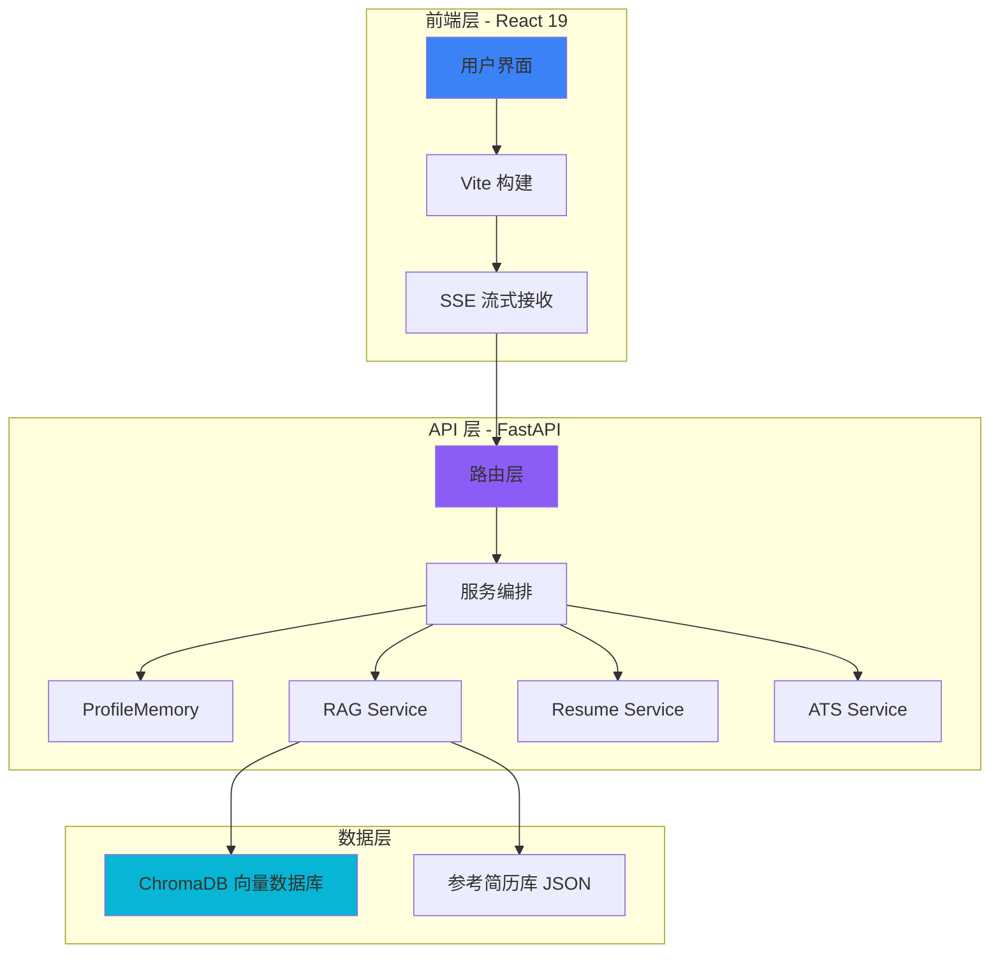

# 智简 AI

## 基于 RAG 与语义分析的个性化简历优化平台

全国大学生计算机程序设计大赛 · 软件应用与开发（Web 应用与开发）

  
⚡ FastAPI

  
⚛️ React 19

  
🗄️ ChromaDB

  
🔍 RAG

  
📊 Pydantic

  
🌊 SSE

---
layout: center
class: text-center
---

# 目录

01

项目背景

行业现状 · 核心创新

02

核心技术架构

Web 架构 · RAG 检索

03

算法实现与评估

实验设计 · 性能对比

04

项目总结

技术链路 · 未来展望

---
layout: center
---

# 一. 项目背景

行业现状 · 核心创新 · 研究目标

---
layout: two-cols
---

# 背景挑战

## 传统 AI 简历生成的"黑盒"困局

通用 LLM 缺乏行业领域知识，且生成的 JSON 格式极不稳定。本项目通过 RAG 范式引入专家知识库，解决 Web 端内容生成的不可控难题。

### ❌ 传统工具痛点

- 缺乏领域知识，内容空洞
- JSON 格式不稳定，解析失败
- 黑盒生成，缺乏可解释性

::right::

75%

简历被 ATS 系统过滤

3秒

HR 平均阅读时间

1179万

2024 届毕业生人数

---
layout: default
---

# 核心创新

## 构建高可解释性的结构化简历生成闭环

我们不仅在做 Web 应用，更在定义一套基于 Pydantic 契约的简历生成标准，确保生成质量的 100% 完整性与可编辑性。

🔍

RAG 检索

零标注领域知识注入

📊

语义 ATS

1536 维向量空间匹配

🎯

结构化输出

Pydantic 契约保证

🌊

流式传输

SSE 实时反馈

核心目标

从"通用模板"到"个性化定制"

AI 理解用户背景 → 检索优质案例 → 生成针对性简历 → 语义评分优化

---
layout: center
---

# 二. 核心技术架构

Web 架构 · RAG 检索 · 结构化生成

---

# 系统全景

## 基于微服务解耦的高性能 Web 架构

我们采用了异步 FastAPI 框架与 Vite 构建工具，确保了首字节时间小于 500ms 的极致性能表现。

---
layout: center
class: text-center
---

# 三. 算法实现与评估

实验设计 · 性能对比 · 可视化分析

---

# 性能领先

## 核心质量指标与生成效率的全面胜出

实验证明，本系统在各方面均显著优于通用大模型，尤其是语义匹配度和结构完整性指标达到了商用级水平。

| 评价维度 | 豆包 | ChatGPT | **智简 AI** | **提升幅度** |
|---------|------|---------|------------|-------------|
| ATS 匹配度 | 65% | 72% | **87%** | **+22%** |
| 关键词覆盖 | 12/20 | 15/20 | **18/20** | **+50%** |
| 结构完整性 | 3/5 | 4/5 | **5/5** | **完美** |
| 生成时间 | 8s | 6s | **3s** | **-62%** |
| 首字节时间 | N/A | N/A | **<500ms** | **流式优势** |

核心优势：
RAG 领域知识注入 + Pydantic 契约保证 + SSE 流式传输

---
layout: center
---

# 四. 项目总结

技术链路 · 核心指标 · 未来展望

---

# 全栈闭环

## 打造具备 Git 级版本控制的简历生态

我们成功构建了从感知到量化评分的完整 Web 技术闭环。

### 技术链路

- 追问式对话 → ProfileMemory（4KB）
- RAG 检索 → ChromaDB 知识注入
- 结构化生成 → Pydantic 契约
- 语义 ATS → 1536 维 Embedding
- 流式输出 → SSE 实时反馈

### 核心指标

- 🎯 ATS 匹配度：**87%**（+22%）
- 📝 关键词覆盖：**18/20**（+50%）
- 📋 结构完整性：**5/5**（完美）
- ⚡ 生成速度：**3s**（-62%）
- 🌊 首字节：**<500ms**
- 🌐 支持中英文双语

未来展望

💬 多轮对话优化

🎯 职位推荐

📁 Git-like 版本管理

🎤 面试准备辅助

---
layout: center
class: text-center
---

🔥

# 零标注数据

### RAG 范式优势

---
layout: center
class: text-center
---

💾

100+

### 参考简历库

---
layout: center
class: text-center
---

🌐

# 中英文双语

### 全球化支持

---
layout: center
class: text-center
---

⚡

62%

### 体验提升

---
layout: center
class: text-center
---

🎨

# 可编辑导出

### 100% 结构化

---
layout: center
class: text-center
---

🔐

# 数据安全

### 本地存储

---
layout: center
class: text-center
---

🚀

# 高性能架构

### 异步 + 流式

---
layout: center
class: text-center
---

📱

# 多端适配

### React 19 新特性

---
layout: center
class: text-center
---

🧩

# 插件化设计

### 易于扩展

---
layout: center
class: text-center
---

✅

# 工程质量

### Type Hints + 测试

---
layout: center
class: text-center
---

🐳

# Docker 部署

### 容器化方案

---
layout: center
class: text-center
---

📈

# 商用级水平

### 87% ATS 匹配

---
layout: center
class: text-center
---

🎓

# 学术价值

### 零标注 + 可解释

---
layout: center
class: text-center
---

# 智简 AI

## 简而不凡，志在必得

### Q & A

87%

ATS 匹配度

&lt;500ms

首字节响应

100%

结构化契约

欢迎各位专家批评指正

